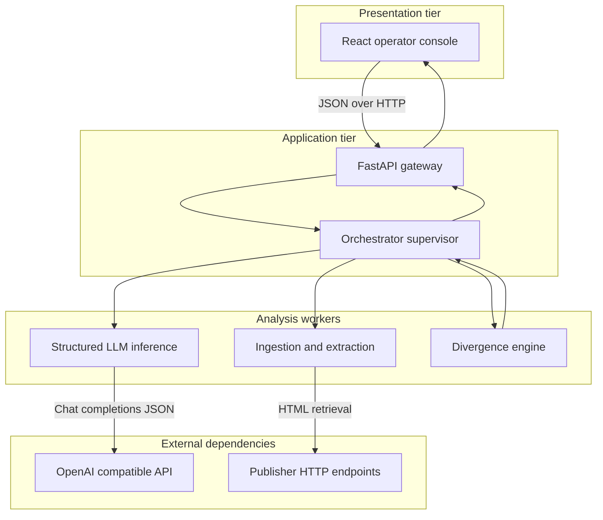
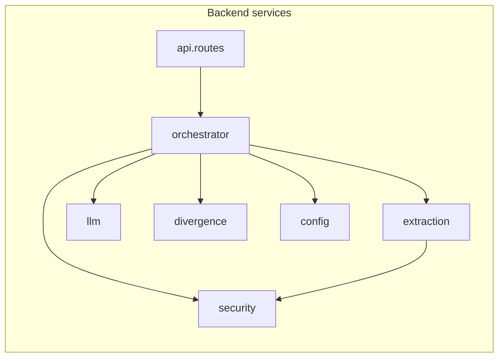
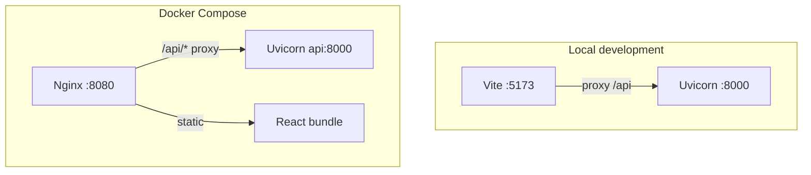
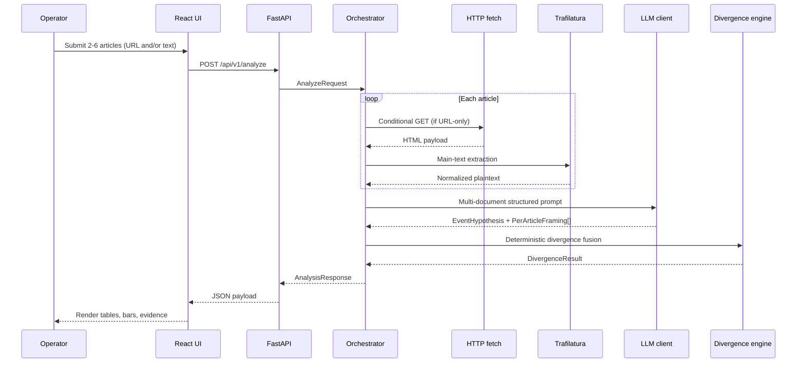
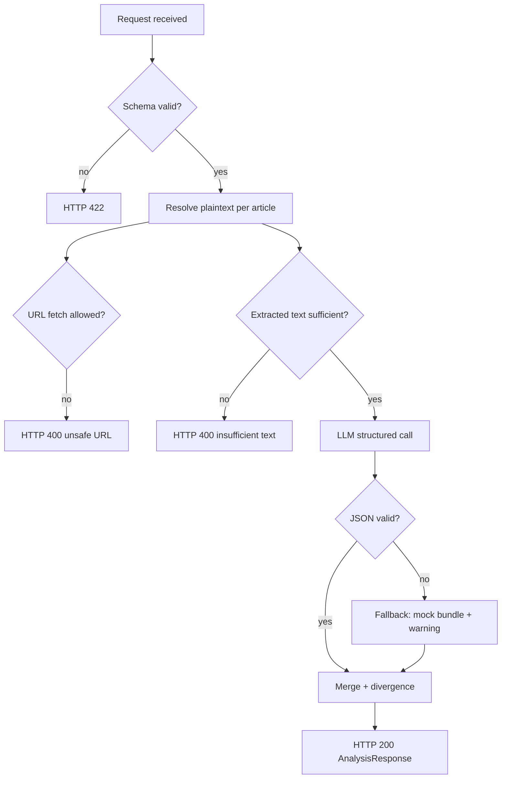
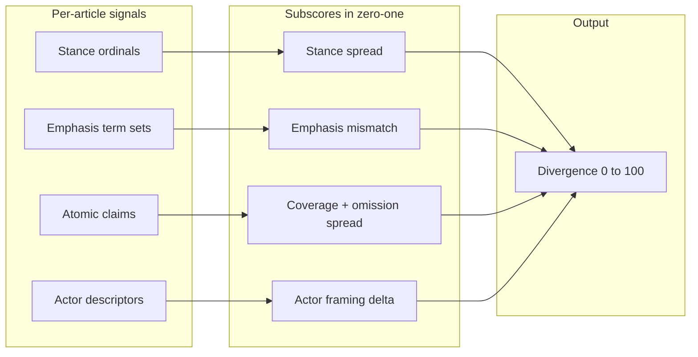

# Multi-Source Narrative Framing Analyzer

## 1. Executive summary

This repository implements a production-oriented research prototype for **comparative narrative framing analysis** across multiple news articles describing the same underlying event. The system is designed for the **Economic Times Gen AI Hackathon 2026**, **Problem Statement 8: AI-Native News Experience**, with emphasis on capabilities aligned to **News Navigator**-style intelligence briefings and **Story Arc**-style interpretability (stance, emphasis, omissions, and cross-source divergence).

The solution deliberately separates:

- **Interpretive inference** (large language model, structured JSON outputs, evidence-linked rationales), from
- **Deterministic aggregation** (a transparent divergence index with explicit subcomponents and weights).

The outcome is a full-stack reference implementation: a **FastAPI** service, a **React** operator console, **SSR-safe URL ingestion** with basic anti-SSRF controls, an **OpenAI-compatible LLM client** (suitable for **Groq**, **OpenRouter**, self-hosted gateways, or OpenAI), and a **mock inference mode** for demonstrations without any remote model.

---

## 2. Problem alignment (ET Hackathon PS-8)

The official brief asks for experiences that move beyond static, one-size-fits-all news consumption. This build targets the following interpretation of that mandate:

| PS-8 build track | How this repository addresses it |
|------------------|-----------------------------------|
| News Navigator (explorable briefings) | Structured cross-article comparison with drill-down evidence spans and omission candidates |
| Story Arc Tracker (narrative signals) | Explicit stance, sentiment, actor framing descriptors, and divergence decomposition |
| Personalization (future extension) | Architecture supports per-user profiles; MVP focuses on analyst-provided corpora |

**Non-goals (MVP):** automated legal or medical advice, binary “fake news” adjudication, or unrestricted web crawling.

---

## 3. System architecture

### 3.1 High-level logical architecture

The system follows a **directed acyclic pipeline** (supervisor orchestrator with specialist stages). Stages communicate exclusively through **versioned structured data** (Pydantic models on the server, TypeScript types on the client).



### 3.2 Component diagram



| Module | Responsibility |
|--------|----------------|
| `app/api/routes.py` | HTTP surface area, error translation, health reporting |
| `app/services/orchestrator.py` | Stage sequencing, recovery paths, provenance assembly |
| `app/services/extraction.py` | Async HTTP fetch, boilerplate stripping, text normalization |
| `app/services/security.py` | SSRF reduction policy for server-side fetches |
| `app/services/llm.py` | Prompting, JSON validation, OpenAI integration, deterministic mock |
| `app/services/divergence.py` | Subscore computation, lexical fallbacks |
| `app/services/framing_grounding.py` | Verbatim check on evidence and claim support quotes |
| `app/schemas/analysis.py` | Contract definitions shared across pipeline stages |

### 3.3 Deployment architecture

Two reference paths exist: **split-process local development** (Vite dev server + Uvicorn) and **composed deployment** (Docker Compose with Nginx fronting static assets and reverse-proxying API traffic).



---

## 4. End-to-end request flow

### 4.1 Sequence diagram (happy path)



### 4.2 State and error handling



---

## 5. Machine learning and inference design

### 5.1 Problem formulation

Let articles be `D_1 ... D_k`. The pipeline estimates:

- A **neutral event hypothesis** `E` (title, summary, entities),
- A **per-document framing record** `F_i` (stance, sentiment, emphasis terms, atomic claims, omission candidates, evidence spans),
- A **divergence statistic** `Delta` on the closed interval `[0, 100]` with interpretable subcomponents.

### 5.2 Model policy

| Decision | Rationale |
|----------|-----------|
| Primary inference via **LLM JSON mode** | Rapid structured extraction for hackathon timelines |
| Temperature set low (0.2) | Reduce sampling variance for evaluation stability |
| Mock path without API keys | Judges can reproduce UI and scoring offline |
| Evidence spans required in prompt contract | Grounding and audit trail for subjective judgments |
| Verbatim grounding pass (`framing_grounding.py`) | Drops evidence lines not found in source text and common model meta-commentary |

### 5.3 Deterministic scoring layer (divergence engine)

The divergence index is computed **after** LLM outputs are coerced into strict schemas. This prevents the aggregate score from being an opaque language-model scalar.



**Weighted fusion (implemented):**

`Delta = 100 * sum_j (w_j * s_j)` where each `s_j` is in `[0, 1]` and the weights satisfy `sum_j w_j = 1`.

Default weights (see `app/services/divergence.py`):

| Subscore | Weight | Description |
|----------|--------|-------------|
| Stance spread | 0.28 | Normalized spread of supportive/neutral/critical encoding |
| Emphasis mismatch | 0.26 | Mean pairwise Jaccard distance of emphasis token sets |
| Coverage + omission spread | 0.26 | Blend of claim-coverage balance across sources and pairwise mismatch of omission-candidate sets |
| Actor framing delta | 0.20 | Mean pairwise Jaccard distance of actor descriptor tokens |

**Band mapping:**

| Divergence range | Band label |
|------------------|------------|
| 0–33 | low |
| 34–66 | moderate |
| 67–100 | high |

### 5.4 Lexical fallback path

If emphasis term lists are empty post-validation, the orchestrator injects deterministic **frequency-based salient tokens** (stopword-filtered) to avoid degenerate divergence results.

---

## 6. Data handling and provenance

| Artifact | Purpose |
|----------|---------|
| `content_sha256` | Integrity fingerprint of normalized article text |
| `excerpt` | Short preview for UI and logging |
| `meta.warnings` | Non-fatal ingestion or inference notices |
| `meta.model_id` | Records configured model id or mock mode |
| `meta.llm_fallback_used` | `true` when a primary API key was set but the successful completion used Groq backup |

**Retention policy (MVP):** ephemeral; operators may extend with a persistence tier.

---

## 7. Security model

| Control | Implementation |
|---------|------------------|
| SSRF reduction | `security.py` restricts schemes and rejects non-public addresses |
| Fetch bounds | Configurable maximum HTML payload size and HTTP timeouts |
| Secret management | Environment variables only; `.env` excluded from version control |
| CORS | Explicit allowlist via `CORS_ORIGINS` |

---

## 8. API specification

### 8.1 `GET /api/v1/health`

Returns process health, pipeline version string, `llm_mode` of `live` or `mock`, `llm_api_host` when live, and `llm_fallback_ready` when Groq backup is configured (`GROQ_API_KEY` + `LLM_FALLBACK_ENABLED`).

### 8.2 `POST /api/v1/analyze`

**Request body (abbreviated):**

```json
{
  "articles": [
    { "url": "https://example.com/a", "source_label": "Outlet A" },
    { "text": "Full plaintext...", "source_label": "Outlet B" }
  ]
}
```

**Constraints:**

- Minimum two articles, maximum six.
- Each article must include at least one of `url` or `text`.
- If both are supplied, **pasted text takes precedence** over fetched HTML for analysis (URL remains for attribution when present).

**Response body:** `AnalysisResponse` as defined in `app/schemas/analysis.py` (event hypothesis, resolved article metadata, framing rows, divergence breakdown, warnings).

---

## 9. Repository layout

```text
ET-Hackathon/
  README.md
  docker-compose.yml
  .env.example
  fixtures/
    sample_request.json
  backend/
    Dockerfile
    requirements.txt
    app/
      main.py
      config.py
      api/
      schemas/
      services/
        llm_client.py
    tests/
  frontend/
    Dockerfile
    nginx.conf
    package.json
    vite.config.ts
    src/
```

---

## 10. Configuration reference

| Variable | Meaning | Default |
|----------|---------|---------|
| `OPENAI_API_KEY` or `LLM_API_KEY` | **Primary** provider API secret (OpenRouter, OpenAI, etc.) | empty |
| `OPENAI_BASE_URL` or `LLM_BASE_URL` | Primary OpenAI-compatible base URL | unset (native OpenAI) |
| `OPENAI_MODEL` or `LLM_MODEL` | Primary model id | `gpt-4o-mini` |
| `GROQ_API_KEY` | **Separate** Groq secret for **automatic fallback** (or Groq-only if primary unset) | empty |
| `GROQ_MODEL` | Fallback / Groq-only model (default tuned for quality) | `llama-3.3-70b-versatile` |
| `LLM_FALLBACK_ENABLED` | After primary failure, try Groq when `GROQ_API_KEY` is set | `true` |
| `LLM_FALLBACK_MAX_CHARS_PER_ARTICLE` | Truncate text per article on fallback to save tokens | `8000` |
| `LLM_PRIMARY_RATE_LIMIT_RETRIES` | Primary only: retries after `RateLimitError` with backoff before Groq | `2` |
| `USE_MOCK_LLM` | Force deterministic mock inference | `false` |
| `LLM_JSON_RESPONSE_FORMAT` | Send `response_format: json_object`; on failure retry without it (per provider) | `true` |
| `OPENROUTER_HTTP_REFERER` / `OPENROUTER_X_TITLE` | Optional OpenRouter attribution headers | unset |
| `CORS_ORIGINS` | Comma-separated browser origins | Local Vite defaults |
| `MAX_URL_FETCHES` | Upper bound on articles | `6` |
| `MAX_HTML_BYTES` | Download cap | `2000000` |

See `backend/.env.example` for copy-paste templates. For local runs, create a **repository root** `.env` (gitignored); `app/config.py` loads that file automatically regardless of whether you start Uvicorn from `backend/` or the repo root. **Do not commit `.env`.** You may set **both** `LLM_API_KEY` (OpenRouter) and `GROQ_API_KEY` so rate limits on the primary route automatically fail over to Groq.

`GET /api/v1/health` includes `llm_fallback_ready` when Groq fallback is configured.

### 10.1 Zero-cost inference (Groq, OpenRouter)

Provider offerings and quotas change over time; verify current terms on each site.

| Provider | Typical base URL | Notes |
|----------|------------------|--------|
| Groq | `https://api.groq.com/openai/v1` | Fast inference; free tier with account; pick a current model ID from their docs |
| OpenRouter | `https://openrouter.ai/api/v1` | Aggregates many models; filter for free or low-cost models; set referer/title headers when requested |
| Local (e.g. LM Studio, Ollama) | e.g. `http://host.docker.internal:1234/v1` | No API bill; you host the GPU/CPU; ensure the tunnel is not exposed publicly without authentication |

**OpenRouter + Groq fallback (recommended for judge demos):**

```bash
LLM_API_KEY="your_openrouter_key"
OPENAI_BASE_URL="https://openrouter.ai/api/v1"
OPENAI_MODEL="meta-llama/llama-3.3-70b-instruct:free"
GROQ_API_KEY="your_groq_key"
GROQ_MODEL="llama-3.3-70b-versatile"
LLM_FALLBACK_ENABLED=true
OPENROUTER_HTTP_REFERER="https://github.com/your-org/your-repo"
OPENROUTER_X_TITLE="Narrative Framing Analyzer"
USE_MOCK_LLM=false
```

**Groq-only:**

```bash
GROQ_API_KEY="your_key"
GROQ_MODEL="llama-3.3-70b-versatile"
USE_MOCK_LLM=false
```

**Groq as primary via base URL (alternative to GROQ_API_KEY-only):**

```bash
LLM_API_KEY="your_key"
OPENAI_BASE_URL="https://api.groq.com/openai/v1"
OPENAI_MODEL="llama-3.3-70b-versatile"
USE_MOCK_LLM=false
```

If a provider rejects `response_format`, the client retries without it for **that** provider before moving to the next provider in the chain. On the **primary** provider, `RateLimitError` triggers a short exponential backoff (`LLM_PRIMARY_RATE_LIMIT_RETRIES`) before giving up and trying Groq.

### 10.2 Zero-cost and low-cost hosting

| Pattern | Cost | Notes |
|---------|------|--------|
| Local demo + screen recording | No hosting bill | Suitable for hackathon video submission |
| **Render**, **Fly.io**, **Railway**, **Google Cloud Run** (free tiers) | Often $0 within tier limits | Deploy the API container; serve the static frontend from the same origin or use the included Nginx compose pattern |
| **Cloudflare Pages**, **GitHub Pages**, **Vercel** (static) | $0 for static sites | Build `frontend` with `npm run build`; point `VITE_*` or reverse-proxy `/api` to your API URL; update `CORS_ORIGINS` to your production web origin |

**CORS:** Any time the browser origin differs from the API host, append the exact origin (scheme + host + port) to `CORS_ORIGINS` on the API.

**Secrets:** Never commit `.env`; store provider keys in the host’s secret manager (Render/Fly/Railway dashboards).

---

## 11. Local development and container deployment

### 11.1 Backend (Python 3.10+ recommended; 3.9 supported)

Use an isolated virtual environment so inference and web dependencies do not pollute the system Python.

```bash
cd backend
python3 -m venv .venv
source .venv/bin/activate   # Windows: .venv\Scripts\activate
pip install --upgrade pip setuptools wheel
pip install -r requirements.txt
cp .env.example .env          # or use repository-root .env (see §10)
uvicorn app.main:app --reload --host 127.0.0.1 --port 8000
```

On **Python 3.9**, `requirements.txt` pulls in `eval_type_backport` so Pydantic can resolve modern union syntax; upgrading to **3.10+** is preferable when available.

### 11.2 Frontend

```bash
cd frontend
npm install
npm run dev
```

The Vite development server proxies `/api` to `http://127.0.0.1:8000`. The UI uses client-side routes: `/` (workspace) and `/methodology`. Static hosting must fall back to `index.html` for those paths (the included Nginx config already does).

### 11.3 Docker Compose

```bash
cp .env.example .env
docker compose up --build
```

Browse the bundled UI at `http://localhost:8080`. The Nginx route `/api/*` proxies to the API service.

---

## 12. Quality assurance and testing

```bash
cd backend
PYTHONPATH=. python -m unittest discover -s tests -p 'test_*.py'
```

The included tests focus on **monotonic sanity properties** of the divergence engine and lexical fallback behavior, which are stable across LLM versions.

**Recommended manual verification checklist:**

- Two near-duplicate articles produce lower divergence than two adversarially opposed pastiches.
- Mock mode emits explicit warnings in `meta.warnings`.
- Unsafe URLs (loopback, private ranges) are rejected with HTTP 400.

---

## 13. Operational considerations

| Topic | Guidance |
|-------|----------|
| Rate limits | Respect upstream LLM quotas; add queueing if moving beyond MVP |
| Publisher ToS | Prefer operator-supplied text for sensitive demonstrations |
| Model upgrades | Record `meta.model_id` in submission artifacts for reproducibility |
| Cost control | Prefer free-tier Groq/OpenRouter models; mock mode for CI; single multi-article LLM call per analysis |

---

## 14. Known limitations and mitigations

| Limitation | Mitigation |
|------------|------------|
| Paywalled pages may extract poorly | Pasted full text path |
| Subjective stance labels | Evidence spans + deterministic fusion + documented limitations in UI copy |
| LLM JSON drift | Pydantic validation with recovery rows and mock fallback |
| Single-region deployment | Stateless API; scale horizontally behind a load balancer |

---

## 15. Roadmap (post-MVP)

1. Embedding-based paragraph alignment for finer-grained omission detection.
2. Temporal story arcs with dated evidence tiles.
3. User profiles for personalized emphasis weighting (within PS-8 personalization track).
4. Optional enterprise deployment with OAuth2 and audit log export.

---

## 16. References

- FastAPI documentation: [https://fastapi.tiangolo.com/](https://fastapi.tiangolo.com/)
- OpenAI API reference (Chat Completions): [https://platform.openai.com/docs/](https://platform.openai.com/docs/)
- Groq (OpenAI-compatible API): [https://console.groq.com/docs/](https://console.groq.com/docs/)
- OpenRouter API: [https://openrouter.ai/docs/](https://openrouter.ai/docs/)
- Trafilatura (main-text extraction): [https://trafilatura.readthedocs.io/](https://trafilatura.readthedocs.io/)
- OWASP SSRF prevention cheat sheet: [https://cheatsheetseries.owasp.org/cheatsheets/Server_Side_Request_Forgery_Prevention_Cheat_Sheet.html](https://cheatsheetseries.owasp.org/cheatsheets/Server_Side_Request_Forgery_Prevention_Cheat_Sheet.html)

---

## 17. Legal disclaimer

This software performs **framing and comparative text analytics**. It does **not** certify factual accuracy, legal compliance, or investment suitability. Operators are responsible for complying with applicable copyright, terms of service, and data protection regulations when fetching or processing third-party content.
